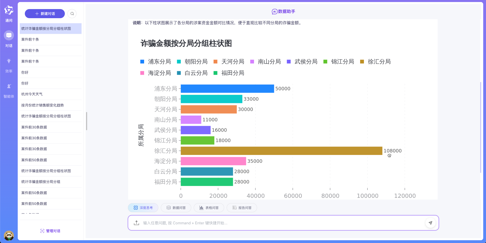

# GPT-VIS-API

> 基于 Node.js 和 Express 构建的图表生成服务，支持将生成的图表上传至 MinIO 并返回预签名 URL。

## 📌 项目概述

**GPT-VIS API** 是一个轻量级图表生成服务，旨在解决 [antv/mcp-server-chart](https://github.com/antvis/mcp-server-chart) 
在私有化部署方面的局限性。该服务接收数据请求，生成图表图像，上传到 MinIO 对象存储，并返回带有效期的预签名访问链接。

主要功能包括：
- 接收 JSON 格式的数据请求
- 使用 AntV/G 生成图表（如折线图、柱状图等）
- 将图表图片上传至 MinIO 存储
- 返回图片的预签名 URL 供前端访问

---

## 🎬 运行效果
- [sanic-web](https://github.com/apconw/sanic-web)项目对接效果如下：


## 🔧 环境准备

### 1. 安装依赖

确保已安装以下工具：
- Docker
- Docker Compose
---

## 🐳 部署方式

### 构建镜像

```bash
docker build -t gpt-vis-api .
```

## 启动服务
```bash
docker-compose up -d
```
> ⚠️ 注意：请先根据实际环境修改 docker-compose.yml 中的 MinIO 配置（如 accessKey、secretKey），然后重启服务。

## 🧪 接口测试
### 测试接口
访问地址：http://localhost:3100/generate

```bash
curl -X POST http://localhost:3100/generate \
  -H "Content-Type: application/json" \
  -d '{
    "type": "line",
    "data": [
      {"time": "2025-05", "value": 512},
      {"time": "2025-06", "value": 1024}
    ]
  }'

响应示例：
{
  "url": "https://minio.example.com/gpt-vis/chart-123.png?Expires=XYZ"
}
```