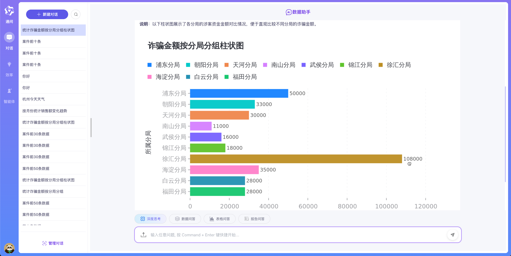
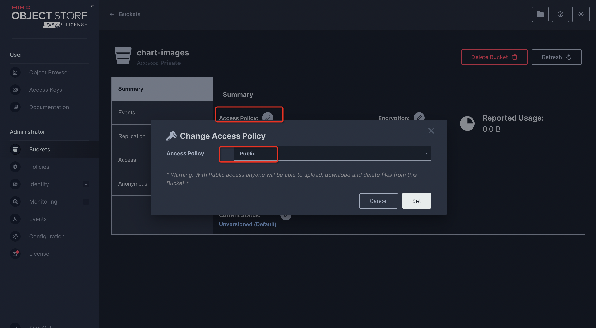
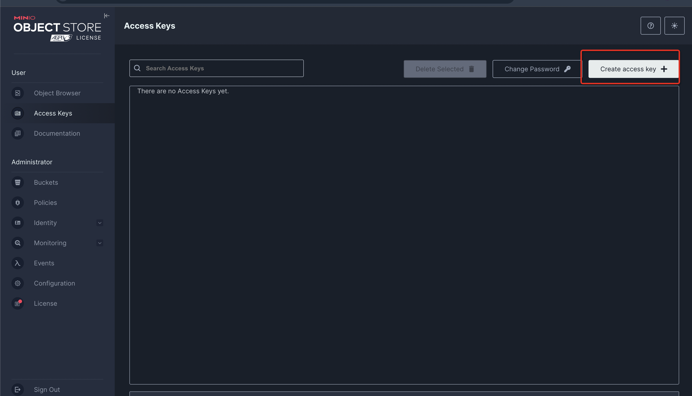

# GPT-VIS-API

> 基于 Node.js 和 Express 构建的图表生成服务，支持将生成的图表上传至 MinIO 并返回预签名 URL。

## 📌 项目概述

**GPT-VIS API** 是一个轻量级图表生成服务，旨在解决 [antv/mcp-server-chart](https://github.com/antvis/mcp-server-chart) 
在私有化部署方面的局限性。该服务接收数据请求，生成图表图像，上传到 MinIO 对象存储，并返回带有效期的预签名访问链接。

主要功能包括：
- 接收 JSON 格式的数据请求
- 使用 AntV/G 生成图表（如折线图、柱状图等）
- 将图表图片上传至 MinIO 存储
- 返回图片的预签名 URL 供前端访问

---

## 🎬 运行效果
- [sanic-web集成部署流程参考语雀文档](https://www.yuque.com/lihuan-ulutg/kb/eqier012gbin4rb2?singleDoc#%20%E3%80%8A%E5%A4%A7%E6%A8%A1%E5%9E%8B%E6%95%B0%E6%8D%AE%E5%8A%A9%E6%89%8B-v1.1.5%E9%83%A8%E7%BD%B2%E6%AD%A5%E9%AA%A4%E3%80%8B)
- [sanic-web](https://github.com/apconw/sanic-web)项目对接效果如下：


## QA交流群
- 大模型应用交流群欢迎大家, 欢迎加进群讨论分享经验
- 关注下面的公众号点击·**微信群**菜单添加微信拉你入群

|                 微信群                 |
|:-----------------------------------:|
|  | 

## 🔧 环境准备

### 1. 安装依赖

确保已安装以下工具：
- Docker
- Docker Compose
---

## 🚀 **快速启动**

### 第一步 克隆仓库
```bash
git clone git@github.com:apconw/gpt-vis-api.git

# 启动服务
docker-compose up -d
```
### 第二步 minio配置
- 登录minio控制台http://localhost:19201 admin/12345678
- 1.手动创建minio 名字为chart-images的bucket **要求public类型的bucket**
- 2.创建accessKey和secretKey 修改docker-compose.yml中minio的配置重启即可
- 3.执行docker-compose down 停止服务
- 4.执行docker-compose up -d 重启服务
- 5.docker-compose.yml中minio的配置可以根据实际情况配置对应服务器ip：
**MINIO_PUBLIC_DOMAIN: "http://localhost:19000"**





> ⚠️ 注意：请先根据实际环境修改 docker-compose.yml 中的 MinIO 配置（如 accessKey、secretKey），然后重启服务。

## 🐳 构建镜像

```bash
make build
```

## 🧪 接口测试
### 测试接口
访问地址：http://localhost:3100/generate

### 图表类型定义

| 图表类型               | 说明   |
|--------------------|------|
| area               | 区域   |
| bar                | 柱状   |
| boxplot            | 箱线   |
| column             | 直方   |
| dual-axes          | 双轴   |
| fishbone-diagram   | 鱼骨图  |
| flow-diagram       | 流程   |
| funnel             | 漏斗   |
| histogram          | 直方   |
| line               | 折线   |
| liquid             | 水波   |
| mind-map           | 思维导  |
| network-graph      | 网络图  |
| organization-chart | 组织结构 |
| pie                | 饼    |
| radar              | 雷达   |
| sankey             | 桑基   |
| scatter            | 散点   |
| treemap            | 树    |
| venn               | 维恩图  |
| violin             | 小提琴图  |
| word-cloud         | 词云   |

```bash
curl -X POST http://localhost:3100/generate \
  -H "Content-Type: application/json" \
  -d '{
    "type": "line",
    "data": [
      {"time": "2025-05", "value": 512},
      {"time": "2025-06", "value": 1024}
    ]
  }'

响应示例：
{
  "url": "https://minio.example.com/gpt-vis/chart-123.png?Expires=XYZ"
}

curl -X POST http://localhost:3100/generate \
  -H "Content-Type: application/json" \
  -d '{
    "type": "sankey",
    "data": [
        {
            "source": "访问网站",
            "target": "浏览商品",
            "value": 1500
        },
        {
            "source": "浏览商品",
            "target": "加入购物车",
            "value": 900
        },
        {
            "source": "加入购物车",
            "target": "进入结算",
            "value": 600
        },
        {
            "source": "进入结算",
            "target": "完成支付",
            "value": 400
        },
        {
            "source": "进入结算",
            "target": "放弃结算",
            "value": 200
        },
        {
            "source": "加入购物车",
            "target": "离开网站",
            "value": 300
        },
        {
            "source": "浏览商品",
            "target": "离开网站",
            "value": 600
        },
        {
            "source": "访问网站",
            "target": "立即离开",
            "value": 500
        }
    ],
    "nodeAlign": "center",
    "style": {
        "backgroundColor": "#f8f9fa",
        "palette": [
            "#4e79a7",
            "#f28e2b",
            "#e15759",
            "#76b7b2",
            "#59a14f",
            "#edc948",
            "#b07aa1",
            "#9c755f"
        ],
        "texture": "default"
    },
    "theme": {
        "fontFamily": "WenQuanYi Zen Hei"
    },
    "width": 800,
    "height": 500,
    "title": "用户购买旅程桑基图",
    "source": "mcp-server-chart"
}'

curl -X POST http://localhost:3100/generate \
  -H "Content-Type: application/json" \
  -d '{
    "data": [
        {
            "category": "浏览网站",
            "value": 50000
        },
        {
            "category": "放入购物车",
            "value": 35000
        },
        {
            "category": "生成订单",
            "value": 25000
        },
        {
            "category": "支付订单",
            "value": 15000
        },
        {
            "category": "完成交易",
            "value": 8000
        }
    ],
    "style": {
        "backgroundColor": "#ffffff",
        "palette": [
            "#FF6B6B",
            "#4ECDC4",
            "#45B7D1",
            "#96CEB4",
            "#FFEAA7"
        ],
        "texture": "default"
    },
    "theme": "default",
    "width": 600,
    "height": 400,
    "title": "用户转化漏斗图",
    "type": "funnel"
}'


# 组织架构图
curl -X POST http://localhost:3100/generate \
  -H "Content-Type: application/json" \
  -d '{
  "data": {
    "name": "CEO",
    "description": "首席执行官",
    "children": [
      {
        "name": "CTO",
        "description": "首席技术官",
        "children": [
          {
            "name": "研发经理",
            "description": "负责研发团队管理",
            "children": [
              {
                "name": "高级工程师 张伟",
                "description": "5年经验"
              },
              {
                "name": "工程师 李娜",
                "description": "2年经验"
              }
            ]
          },
          {
            "name": "架构师 王强",
            "description": "系统架构设计"
          }
        ]
      },
      {
        "name": "CFO",
        "description": "首席财务官",
        "children": [
          {
            "name": "财务经理",
            "description": "负责财务团队管理"
          }
        ]
      },
      {
        "name": "COO",
        "description": "首席运营官",
        "children": [
          {
            "name": "市场总监",
            "description": "负责市场战略"
          },
          {
            "name": "运营经理",
            "description": "负责日常运营"
          }
        ]
      }
    ]
  },
  "orient": "vertical",
  "style": {
    "backgroundColor": "#f8f9fa",
    "texture": "default"
  },
  "theme": "default",
  "width": 800,
  "height": 600,
  "type":"organization-chart"
}'
```